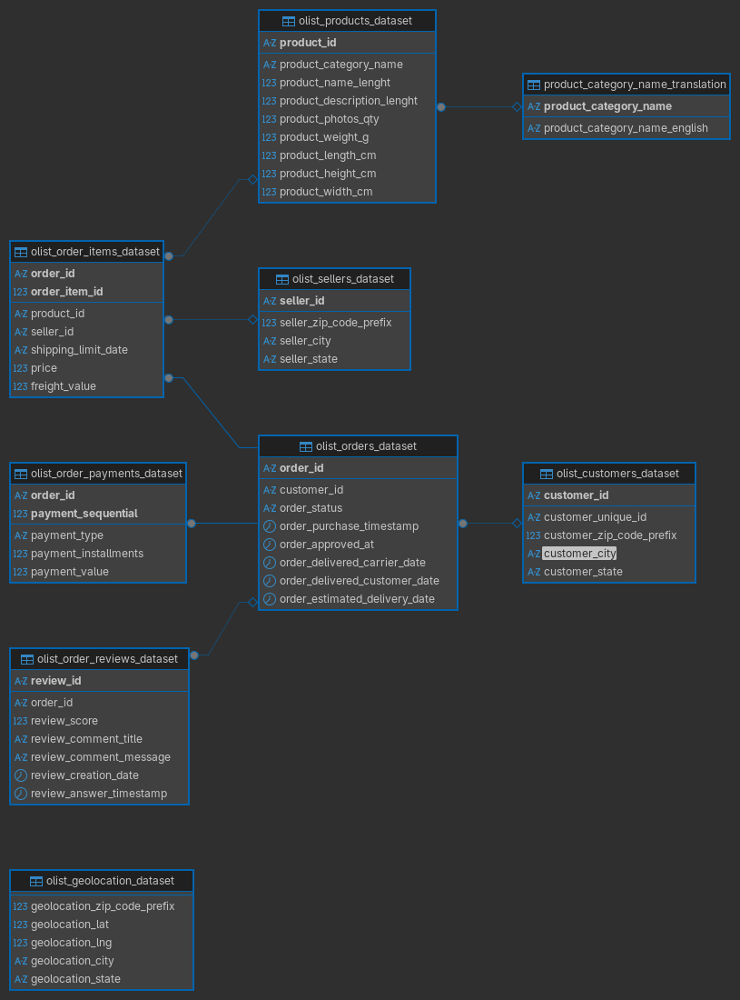

# Olist E-Commerce: relational schema design & SQL optimization
This project is an analytical SQL and database optimization case study based on the real-world Olist Brazilian E-Commerce dataset. While many data projects focus solely on writing basic `SELECT` queries, this repository covers the core relational design lifecycle: taking a raw, unconstrained multi-table CSV dataset, architecting a normalized relational schema in PostgreSQL, implementing performance optimizations, and writing complex analytical queries.

The primary goal of this project was to transform raw, unorganized e-commerce transactional data into a clean, highly structured PostgreSQL database capable of delivering fast, reliable business insights regarding customer behavior, logistics efficiency, seller performance, and payment distributions.

### 1. Data domain analysis

Before building the schema, I spent time understanding the core business entities and their interactions within the Brazilian e-commerce ecosystem. The system handles complex multi-seller order fulfillment with the following key entities:

├── Customers (buyer profiles & location metrics)\
├── Orders (core transactional hub & status tracking)\
├── Order Items (order line items & price/freight split)\
├── Products (product categories & physical dimensions)\
├── Sellers (merchant profiles & origin locations)\
├── Order Payments (multi-method split payment records)\
├── Order Reviews (customer satisfaction & timestamped feedback)\
└── Geolocation (zip code prefixes & coordinates)

### 2. ER diagram


### 3. Key design decisions

##### 3.1. Foreign Keys & Integrity Constraints over Raw Ingestion
The raw Olist dataset contains orphaned records and missing relational guarantees.

Therefore, I designed a strict DDL schema enforcing Primary Keys, Foreign Keys with `ON DELETE RESTRICT` / `CASCADE` policies, and `NOT NULL` constraints across all 8 core tables. Data cleanups were performed prior to enforcing strict relational constraints.

##### 3.2. Financial precision: numeric vs. float
E-commerce transactional records require absolute precision for monetary calculations (e.g., item price, freight values, payment installments).

Why `NUMERIC(10, 2)` instead of `FLOAT` or `DOUBLE PRECISION`?  
Floating-point types introduce IEEE 754 binary floating-point representation errors during aggregation operations (`SUM`, `AVG`). Using `NUMERIC(10, 2)` guarantees exact decimal arithmetic required for financial reporting and auditing.

##### 3.3. Handling multi-payment transactions
A single order in Olist can be paid using multiple payment methods (e.g., credit card + voucher) or split into several installments.

Instead of storing payment columns directly inside the `orders` table (which would violate First Normal Form), I maintained a separate `order_payments` table with a composite key `(order_id, payment_sequential)`. This cleanly handles multi-payment transactions without schema inflation or data duplication.

### 4. Database schema & Analytical qeries

##### 4.1. DDL & strict constraint enforcement
To guarantee data quality at the database level, explicit schemas were defined with strict data typing and domain validation rules.

```sql
CREATE TABLE orders (
    order_id UUID PRIMARY KEY,
    customer_id UUID NOT NULL REFERENCES customers(customer_id) ON DELETE RESTRICT,
    order_status VARCHAR(20) NOT NULL,
    order_purchase_timestamp TIMESTAMP WITH TIME ZONE NOT NULL,
    order_approved_at TIMESTAMP WITH TIME ZONE,
    order_delivered_carrier_date TIMESTAMP WITH TIME ZONE,
    order_delivered_customer_date TIMESTAMP WITH TIME ZONE,
    order_estimated_delivery_date TIMESTAMP WITH TIME ZONE NOT NULL,
    CONSTRAINT check_order_status CHECK (
        order_status IN ('delivered', 'shipped', 'canceled', 'unavailable', 'invoiced', 'processing', 'created', 'approved')
    )
);
```

##### 4.2. Analytical window functions & aggregations

To derive complex business metrics (such as customer lifetime value, seller delivery latency, and monthly revenue growth rate), complex analytical queries were constructed using PostgreSQL Window Functions (RFM Analysis, NTILE, LAG, PARTITION BY).

```sql 
WITH seller_category_revenue AS (
SELECT
p.product_category_name,
oi.seller_id,
SUM(oi.price) AS total_revenue,
DENSE_RANK() OVER (
PARTITION BY p.product_category_name
ORDER BY SUM(oi.price) DESC
) as category_rank
FROM order_items oi
JOIN products p ON oi.product_id = p.product_id
GROUP BY p.product_category_name, oi.seller_id
)
SELECT *
FROM seller_category_revenue
WHERE category_rank <= 3;
```


### 5. Indexing & Execution plan optimization
##### 5.1. B-Tree indexing strategy on foreign keys & timestamp ranges

Analytical queries frequently join fact tables (order_items, orders) on foreign keys and filter by time ranges (order_purchase_timestamp).

By default, PostgreSQL does not automatically create indexes on foreign key columns. I created explicit B-Tree indexes on all relational junctions and frequently filtered timestamp columns.

### 6. My pitfalls and solutions

Designing the relational database and refactoring the SQL queries was a major learning experience in PostgreSQL performance mechanics and query planner behavior. Here are the main lessons learned along the way.

##### Lesson one: the CTE performance trap
When writing complex analytical queries, I initially relied heavily on deeply nested Common Table Expressions (CTEs) for code readability.

However, in older PostgreSQL execution engines (and depending on MATERIALIZED settings), CTEs act as optimization barriers. The query planner evaluates each CTE independently, materializing intermediate result sets in memory without pushing down WHERE clause predicates from the main query.

My solution was to evaluate query execution plans using EXPLAIN ANALYZE. Where CTEs caused memory bottlenecks on large datasets, I refactored them into optimized Subqueries or Inline Derived Tables, allowing the query planner to push down predicates and leverage existing B-Tree indexes.

##### Lesson two: implicit type casting & index invalidation
During early benchmarking, I noticed that queries filtering orders by timestamp weren't using the created B-Tree indexes. The query execution plan defaulted back to a slow Seq Scan.

I realized the issue: casting timestamps or wrapping indexed columns inside functions (e.g., WHERE DATE(order_purchase_timestamp) = '2018-01-01') prevents PostgreSQL from utilizing standard B-Tree indexes on order_purchase_timestamp.

How I fixed it? I refactored all date filtering logic to use explicit range comparison operators (WHERE order_purchase_timestamp >= '2018-01-01 00:00:00' AND order_purchase_timestamp < '2018-01-02 00:00:00'), allowing the query planner to instantly execute a direct B-Tree Index Scan.

### Conclusion

This project demonstrated that database optimization isn't just about extracting data and dumping it into a table — it's about building a robust, performant, and mathematically correct relational environment.

Designing a clean schema with strict constraints, applying targeted indexing strategies based on query planner execution paths (EXPLAIN ANALYZE), and avoiding common SQL antipatterns turned a raw CSV dataset into a production-grade relational database foundation.