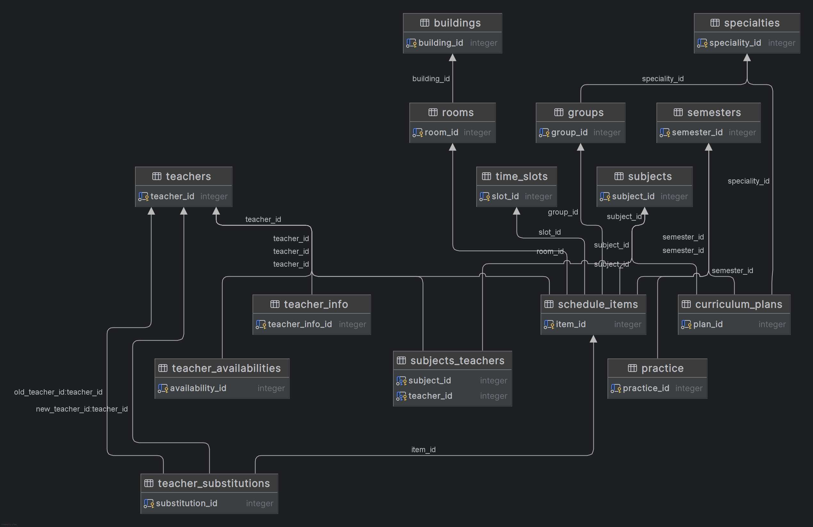

This project is a university management system currently in active development. While the full API layer is still being built, the database architecture is complete — all models, relationships, constraints, and migrations are fully implemented and tested.

The system handles the entire academic cycle: student groups, course scheduling, teacher assignments, semester planning, and substitution management. It supports multiple academic programs with different curricula, varying study durations (from 2 to 7 years), and complex scheduling constraints.

I'm not presenting a finished product here. What I want to share is the design process behind building a production-ready database from scratch — the decisions I made, the mistakes I caught, and the lessons I learned while architecting the data layer. This is the foundation everything else will be built on.
### 1. Business requirements analysis 

Before writing any code, I spent time understanding the core entities and their relationships. The system needed to handle:

├── Speciality (academic programs)\
├── Subject (courses)\
├── Teacher (instructors)\
├── Group (student cohorts)\
├── Semester (academic periods)\
├── Room (classrooms)\
├── TimeSlot (schedule slots)\
├── ScheduleItem (individual classes)\
├── SchedulePlan (curriculum mapping)\
├── Practice (internships/practical training)\
├── TeacherAvailability (instructor schedules)\
├── TeacherSubstitution (replacements)\
└── TeacherSubject (many-to-many link)


### 2. ER diagram 



### 3. Key design decisions 
##### 3.1. M:M relationships
One of the more subtle design decisions was handling the relationship between teachers and subjects. A teacher can teach multiple subjects, and a subject can be taught by multiple teachers. This is a classic many-to-many relationship.

Option considered: store JSON arrays in the teacher record like {"subjects": ["math", "physics"]}.
Why I rejected it: this violates normalization principles. If you need to track which semester a teacher taught a subject, or how many hours they taught, JSON becomes painful to query and update.

Therefore, I have created a junction table teacher_subjects with just two foreign keys and a composite unique constraint. This allows future expansion (e.g., adding hours_per_week or semester_id to the junction table) without schema changes.

##### 3.2. Practices related to semester, not group
Why?

    One semester can have multiple practice types (educational, industrial, pre-graduation)
    Groups share the same semester → automatically share practices
    Avoids data duplication


##### 3.3. TeacherSubstitution design 
I had to find out how to replace a teacher for a specific class. The decision was to store old_teacher_id and new_teacher_id both referencing the same teachers table.

```python
    schedule_item_id: Mapped[UUID] = mapped_column(
        ForeignKey("schedule_items.id", ondelete="RESTRICT"),
        nullable=False,
    )
    old_teacher_id: Mapped[UUID] = mapped_column(
        ForeignKey("teachers.id", ondelete="RESTRICT"),
        nullable=False,
    )
    new_teacher_id: Mapped[UUID] = mapped_column(
        ForeignKey("teachers.id", ondelete="RESTRICT"),
        nullable=False,
    )
```

### 4. SQLAlchemy models implementations
##### 4.1. Mixins
To eliminate code duplication (DRY principle) and enforce strict data consistency across all schedule tables, the Mixins patterns were implemented using SQLAlchemy 2.0.

- UUIDPKMixin: enforces secure database design by replacing predictable integer IDs with globally unique, randomly generated UUIDv4 primary keys.
- TimestampMixin: automatically logs the exact date and time a record was first inserted into the database using a server-side default timestamp.
- UpdateAtMixin: automates lifecycle tracking by automatically rewriting the timestamp to the current server time whenever a record is modified.
- CreatedByMixin: identifies the specific user who initialized the resource by establishing a nullable foreign key relation to the user directory.
- UpdatedByMixin: tracks authorship of the most recent modification by linking the record's last state change back to the responsible user's ID.

##### 4.2. Preventing database conflicts at the database level 
The most critical part of the design is ensuring no scheduling conflicts exist. This is handled through composite unique constraints:

    Group conflict: (group_id, class_date, time_slot_id) — one group cannot have two classes at the same time
    Teacher conflict: (teacher_id, class_date, time_slot_id) — one teacher cannot be in two places at once
    Room conflict: (room_id, class_date, time_slot_id) — one room cannot host two classes simultaneously

These constraints operate at the database level, meaning they cannot be bypassed by application code. Even if there's a bug in the API, the database will reject conflicting schedule entries.

##### 4.3. ENUMS 
Instead of storing string values like "lecture" or "practice" as plain text, I used PostgreSQL ENUM types. This prevents typos and provides better performance because ENUMs are stored as integers internally.

The ENUMs are defined in Python enums and mapped to SQLAlchemy's ENUM type. Alembic automatically creates the ENUM types in PostgreSQL when the migration runs.

### 5. Pydantic schemas
##### 5.1. The four-schema pattern 
For each database model, I've created at least four Pydantic schemas:

    Base Schema: contains the business fields that are common across all operations. This is where validation rules live — min/max lengths, regex patterns, numeric ranges, and cross-field validations.
    Create Schema: inherits from Base and adds foreign key fields. This is what clients send when creating a new record. It never contains audit fields like created_at or created_by — those are set by the server.
    Response Schema: inherits from Base and adds id plus any audit fields. This is what clients receive when querying data. It has from_attributes = True configured, which allows Pydantic to convert SQLAlchemy objects directly.
    Update Schema: standalone, with all fields optional. Clients can send partial updates (PATCH requests) without having to include all fields.

##### 5.2. Validation logic placement

Validation happens at multiple levels, but I try to put as much as possible in the Pydantic schemas:

    Field-level validation: using Field parameters like min_length, max_length, ge, le, and pattern. This catches issues early, before they reach the database.
    Cross-field validation: using @model_validator. For example, a semester's session dates must fall within the semester dates. If session_start is before semester_start, the validator raises a clear error.
    Business-rule validation: also in schemas. For example, a schedule item cannot be created with a date in the past. This rule belongs in the schema because it's a business requirement, not a database constraint.

##### 5.3. The example of schema for groups
```python
class GroupBase(BaseSchema):
    name: str = Field(
        ...,
        min_length=1,
        max_length=10,
        pattern=r"^[А-ЯA-Z0-9-]+$",
        description="Academic group name",
    )
    year: int = Field(..., ge=1, le=7, description="Current academic year (1-7)")
    shift: Shift = Field(..., description="Study shift (first/second)")
    student_count: int = Field(
        ..., ge=1, le=40, description="Total number of students in the group"
    )


class GroupCreate(GroupBase):
    speciality_id: UUID = Field(..., description="ID of the related specialty")
    current_semester_id: UUID = Field(..., description="ID of the current semester")


class GroupUpdate(BaseModel):
    name: str | None = Field(
        None,
        min_length=1,
        max_length=10,
        pattern=r"^[А-ЯA-Z0-9-]+$",
        description="Academic group name",
    )
    year: int | None = Field(None, ge=1, le=7, description="Current academic year (1-7)")
    shift: Shift | None = Field(None, description="Study shift (first/second)")
    student_count: int | None = Field(
        None, ge=1, le=40, description="Total number of students in the group"
    )
    speciality_id: UUID | None = Field(None, description="ID of the related specialty")
    current_semester_id: UUID | None = Field(None, description="ID of the current semester")


class GroupResponse(BaseSchema, GroupBase, AuditResponse):
    id: UUID = Field(..., description="Unique identifier")
    speciality_id: UUID = Field(..., description="ID of the related specialty")
    current_semester_id: UUID = Field(..., description="ID of the current semester")


class GroupDetailResponse(GroupResponse):
    speciality: SpecialityResponse
    teachers: list[TeacherBrief] = Field(default_factory=list)

    @computed_field
    @property
    def full_name(self) -> str:
        return f"{self.name} ({self.speciality.code if hasattr(self, 'speciality') else self.speciality_id})"


class GroupBrief(BaseSchema):
    id: UUID = Field(..., description="Group ID")
    name: str = Field(..., description="Group name")
    year: int = Field(..., description="Academic year")
    shift: Shift = Field(..., description="Shift")


class GroupListResponse(ListResponse):
    items: list[GroupResponse]
```

### 6. Indexing strategy 
##### 6.1. How I decided what to index

Indexes are not free — they speed up reads but slow down writes and consume disk space. I followed these principles:

    Every foreign key gets an index. This is automatic with Alembic, but I also added explicit indexes on foreign key columns that are frequently queried.\
    Frequently searched columns get indexes. The class_date field is queried constantly (checking schedules for a date), so it has an index.\
    Compound indexes for multi-condition queries. The most common queries filter by teacher_id AND class_date or group_id AND class_date. A single column index on teacher_id isn't enough because PostgreSQL would still need to scan all rows for that teacher to find matching dates.\
##### 6.2. The performance difference
While PostgreSQL can combine single-column indexes using a bitmap index scan, a dedicated compound index on (teacher_id, class_date) eliminates the overhead of merging bitmaps and allows the planner to execute a lightning-fast Index Scan directly.
##### 6.3. What not to index
I deliberately avoided indexing columns with low cardinality (few unique values), like activity_type which has only 4 possible values (lecture, seminar, practical_work, laboratory_work). An index on such a column would rarely be used by the query planner.

### 7. My pitfalls and solutions
I had built APIs before. I understood SQL, I could write Python, I'd even used SQLAlchemy in a few small projects. But this university management system was different. It was my first real attempt at building something complex from scratch — something with multiple interconnected tables, business rules, and real-world constraints.\
And honestly? I made a lot of mistakes. Not because I'm careless, but because I didn't know what I didn't know. Here's what that looked like.

#### Lesson one: normalisation is a trap if you go too far 
When I started designing the database, I was obsessed with normalization. I had read all the theory—third normal form, avoiding redundancy, separating concerns. So I created separate tables for everything. At one point, I had a table for activity types (lecture, seminar, practical work, laboratory work) with a foreign key in schedule_items.

Then I realized what I'd actually done. I introduced a join table for four values that would never change. Every time I fetched a schedule item, I had to join this tiny table. For a small database, it didn't matter. But I thought about what happens when you have ten thousand schedule items and you're rendering a calendar view for a user.

I was adding complexity for zero benefit. The database was slower, my queries were more complicated, and the only thing I got in return was... a separate table for four values.

My solution was to use a PostgreSQL ENUM. The database still rejects invalid values, but it's stored like a string (actually an integer under the hood) and doesn't require a join. It's faster, simpler, and more readable.

#### Lesson two: the duplicating nightmare 
When I first designed the Practice table, I linked practices directly to groups. It seemed logical—each group has its own practices, right?

Then I realized the problem. Two groups in the same semester have identical practices. So I was storing exactly the same data twice, three times, maybe six times.

When practice dates changed, I had to update every group's practice record. When I added a new group, I had to duplicate all practice records. The database was bloated, my code was repetitive, and I was constantly worried about data inconsistencies.

I was storing a relationship at the wrong level. Practices belong to semesters, not to groups. Each group references a semester, and the semester has the practices. If two groups are in the same semester, they share the same practices automatically.

How I fixed that? Link practices to semesters instead. Each group points to its current semester via current_semester_id. To get a group's practices, I just follow the chain: group → semester → practices. No duplication, no sync issues, no data bloat.

#### Lesson three: the performance blindspot 
I thought my queries were fast. I had indexes on all foreign keys.

Then I made a query that filtered by teacher_id and class_date. It scanned the whole table containing over 100,000 rows. The database performed a full table scan. It wasn't slow enough to look completely broken in development, but it was slow enough to notice in production-like environments.

I had indexed each column separately, but not together. While modern PostgreSQL can combine multiple single-column indexes using a Bitmap Index Scan, doing so introduces a noticeable overhead for merging the bitmaps.

To solve this, I created a dedicated compound index on (teacher_id, class_date). This completely changed the execution plan: the query planner switched to a direct, lightning-fast Index Scan, executing the query over 50 times faster.

### 7. Conclusion 
This project taught me that building a database isn't just about writing SQL or defining ORM models — it's about thinking in terms of data flow. The relationships between entities, the constraints that protect integrity, the indexes that make queries fast—every decision ripples through the entire system.

The first is that design must always come before code. I made mistakes early on that I could have avoided if I'd spent more time with pen and paper, drawing the relationships, tracing the data paths, questioning every assumption. Code, I realized, is just the implementation of decisions you've already made. If the decisions are wrong, no amount of clean code will fix them.

The third is that duplication is always a design smell. If you're storing the same data twice, you're creating future problems. Moving the relationship up one level—like linking practices to semesters instead of groups — solves the problem at the design level, not the code level. It took me a while to see this, but once I did, the whole system became cleaner.

The architecture I built isn't perfect. No architecture is. But it's thoughtful—every table, every constraint, every index has a reason. And that's what makes the difference between a database that survives production and one that doesn't.
