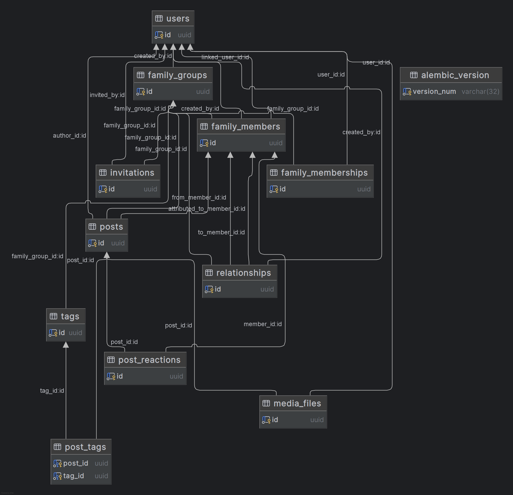
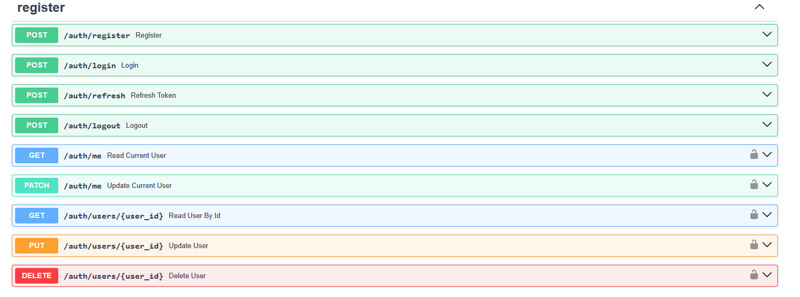
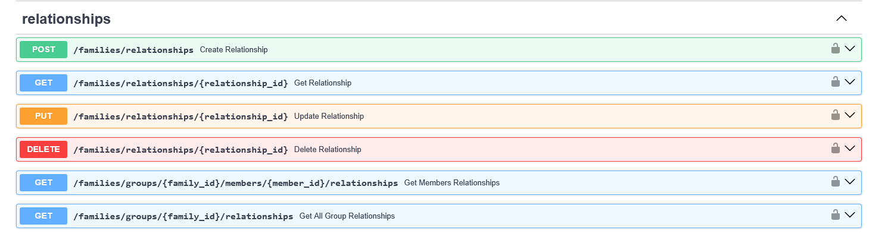

# VETVI: A full-featured Genealogy&Family tree platform
VETVI is a full-stack web application designed to help families build, visualize, and preserve their genealogical history. The project is a complete, real-world implementation of a modern web application, focusing on a robust backend architecture, complex data modeling, and secure API design. While the project includes a React + TypeScript frontend, the core complexity and engineering effort lie in building a reliable and scalable backend to handle the intricate relationships of a family tree.

The system handles the entire family lifecycle: creating family groups, managing member profiles, establishing relationships, sharing posts and media, and ensuring data integrity across all operations.

### 1. Business requirements analysis

Before writing any code, I spent time understanding the core entities and their relationships. The system needed to handle:

├── FamilyGroup (family units)\
├── User (registered accounts)\
├── FamilyMember (individuals in a tree)\
├── Relationship (connections between members)\
├── Post (family feed content)\
├── MediaFile (images, videos, documents)\
├── Tag (categorization for posts)\
├── PostReaction (user engagement)\
├── FamilyMembership (user roles and permissions)\
└── Invitation (join requests via tokens)

### 2. ER diagram 


### 3. Key design decisions
##### 3.1. FamilyMember vs User separation
One of the most critical design decisions was separating the User (account) from the FamilyMember (profile in a family). This allows a single user to have different identities across multiple families while maintaining a single authentication mechanism.

```python
class User(Base):
    __tablename__ = "users"

    id: Mapped[uuid.UUID] = mapped_column(
        UUID(as_uuid=True), primary_key=True, default=uuid.uuid4
    )
    email: Mapped[EmailStr] = mapped_column(
        String(255), nullable=False, unique=True, index=True
    )
    hashed_password: Mapped[str] = mapped_column(String(255), nullable=False)
    display_name: Mapped[str] = mapped_column(String(100), nullable=False)
    avatar_url: Mapped[str | None] = mapped_column(String(500))
    role: Mapped[MembershipRole] = mapped_column(
        Enum(MembershipRole), default=MembershipRole.viewer, nullable=False
    )
    is_active: Mapped[bool] = mapped_column(Boolean, default=True)
    created_at: Mapped[datetime] = mapped_column(
        DateTime(timezone=True), server_default=func.now()
    )
    updated_at: Mapped[datetime] = mapped_column(
        DateTime(timezone=True), server_default=func.now(), onupdate=func.now()
    )
    
    class FamilyMember(Base):
    __tablename__ = "family_members"

    id: Mapped[uuid.UUID] = mapped_column(
        UUID(as_uuid=True), primary_key=True, default=uuid.uuid4
    )
    family_group_id: Mapped[uuid.UUID] = mapped_column(
        ForeignKey("family_groups.id", ondelete="CASCADE"), index=True
    )
    linked_user_id: Mapped[uuid.UUID | None] = mapped_column(
        ForeignKey("users.id", ondelete="SET NULL"), index=True
    )
    display_name: Mapped[str | None] = mapped_column(String(100), nullable=True)

    first_name: Mapped[str | None] = mapped_column(String(100), nullable=False)
    last_name: Mapped[str | None] = mapped_column(String(100))
    patronymic: Mapped[str | None] = mapped_column(String(100))
    maiden_name: Mapped[str | None] = mapped_column(String(100))

    gender: Mapped[GenderEnum] = mapped_column(
        ENUM(GenderEnum, name="gender_enum", inherit_schema=True),
        default=GenderEnum.unknown,
    )
    birth_date: Mapped[date | None] = mapped_column(Date)
    birth_place: Mapped[str | None] = mapped_column(String(300))
    death_date: Mapped[date | None] = mapped_column(Date)
    death_place: Mapped[str | None] = mapped_column(String(300))
    is_alive: Mapped[bool] = mapped_column(Boolean, default=True)

    bio: Mapped[str | None] = mapped_column(Text)
    avatar_url: Mapped[str | None] = mapped_column(String(500))

    created_by: Mapped[uuid.UUID] = mapped_column(ForeignKey("users.id"))
    created_at: Mapped[datetime] = mapped_column(
        DateTime(timezone=True), server_default=func.now()
    )
    updated_at: Mapped[datetime] = mapped_column(
        DateTime(timezone=True), server_default=func.now(), onupdate=func.now()
    )
```

##### 3.2. Post system with multiple engagement layers
The feed system was designed to support rich content and community engagement.

Post:
  - author_id, attributed_to_member_id
  - post_type (text, photo, audio, video, document)
  - title, body

PostReaction:
  - post_id, member_id
  - reaction_type (like, love, haha, wow, sad, angry, laugh)
  - UniqueConstraint(post_id, member_id) ensures one reaction per member per post

The design separates content from media files, allowing multiple files per post with ordering. Reactions are stored separately with a unique constraint, preventing duplicate reactions and enabling the "toggle" behavior (click to add, click again to remove).

##### 3.3. Role-based access control
Rather than a simple boolean "is_admin" flag, I implemented a granular role system:

```python
class MembershipRole(enum.Enum):
    admin = "admin"      # Full access: can manage members, roles, and content
    editor = "editor"    # Can create and edit content, but cannot manage roles
    viewer = "viewer"    # Read-only access
```

This approach prevents common issues like accidental data loss while still allowing family members to participate actively. The roles are enforced at the service layer, not just the API layer, ensuring security even if a frontend client tries to bypass permissions.

##### 3.4. Publishing strategy: the four-schema pattern

For each database model, I've created at least four Pydantic schemas:

    Base Schema: contains the business fields that are common across all operations. This is where validation rules live — min/max lengths, regex patterns, numeric ranges, and cross-field validations.
    Create Schema: inherits from Base and adds foreign key fields. This is what clients send when creating a new record. It never contains audit fields like created_at or created_by — those are set by the server.
    Response Schema: inherits from Base and adds id plus any audit fields. This is what clients receive when querying data. It has from_attributes = True configured, which allows Pydantic to convert SQLAlchemy objects directly.
    Update Schema: standalone, with all fields optional. Clients can send partial updates (PATCH requests) without having to include all fields.

The example of schema for family group: 
```python
class FamilyGroupBase(BaseModel):
    name: str
    description: str | None = None


class FamilyMembershipRead(BaseModel):
    user_id: UUID
    role: MembershipRole
    joined_at: datetime
    model_config = ConfigDict(from_attributes=True)
    is_favourite: bool = False


class FamilyGroupCreate(FamilyGroupBase):
    pass


class FamilyGroupRead(FamilyGroupBase, BaseSchema):
    id: UUID
    created_by: UUID
    created_at: datetime
    updated_at: datetime
    memberships: list[FamilyMembershipRead] = []
    model_config = ConfigDict(from_attributes=True)


class FamilyGroupUpdate(BaseModel):
    name: str | None = None
    description: str | None = None
```

This approach provides strong validation at the API boundary, making the codebase more maintainable and reducing bugs.
##### 3.5. Preventing database conflicts at the database level

The most critical part of the design is ensuring no data inconsistencies exist. This is handled through a combination of database constraints and application-level logic.

These constraints operate at the database level, meaning they cannot be bypassed by application code. Even if there's a bug in the API, the database will reject conflicting data.

##### 3.6. ENUMs for type safety

Instead of storing string values like "male" or "female" as plain text, I used PostgreSQL ENUM types. This prevents typos and provides better performance because ENUMs are stored as integers internally.

```python 
class GenderEnum(enum.Enum):
    male = "male"
    female = "female"
    other = "other"
    unknown = "unknown"

class MembershipRole(enum.Enum):
    admin = "admin"
    editor = "editor"
    viewer = "viewer"

class RelationshipType(enum.Enum):
    parent_child = "parent_child"
    spouse = "spouse"
    sibling = "sibling"
```

##### 4. Relationship validation logic
The validation for parent-child and spouse relationships is implemented in the service layer, with clear error messages:

```python 
async def validate_parent_child_relationship(
    db: AsyncSession,
    family_group_id: UUID,
    parent_id: UUID,
    child_id: UUID,
    exclude_rel_id: UUID | None = None,
) -> tuple[bool, str | None]:

    if parent_id == child_id:
        return False, "Parent and child cannot be the same person"

    stmt = select(Relationship).where(
        and_(
            Relationship.family_group_id == family_group_id,
            Relationship.to_member_id == child_id,
            Relationship.rel_type == RelationshipType.parent_child,
        )
    )
    if exclude_rel_id:
        stmt = stmt.where(Relationship.id != exclude_rel_id)

    result = await db.execute(stmt)
    existing_parent = result.scalars().all()

    if len(existing_parent) >= 2:
        return False, "Child still has two parents"

    ancestor_ids = await get_all_ancestors(db, family_group_id, parent_id)
    if child_id in ancestor_ids:
        return False, "Impossible to create a cycle"

    return True, None

```

### 5. API Documentation
##### 5.1. Authentication & User Management Architecture  

To secure university operations, I implemented a custom JWT-based authentication system rather than relying on heavy third-party plugins. This approach provides fine-grained control over payload structure, security configurations, and token lifecycles.



To balance security and user experience, the authentication engine relies on two distinct token types with strict lifecycle parameters:  Access Tokens: Fast-expiring (15 minutes), lightweight cryptographic keys carrying user IDs and Role-Based Access Control (RBAC) claims. They are passed in request headers for zero-latency authorization checks.  Refresh Tokens: Long-lived (14 days) state-tracking credentials used to silently rotate expired access tokens.  Instead of exposing both tokens to local storage (which leaves the application vulnerable to XSS attacks), Refresh Tokens are locked down via server-side cookies using strict production-ready attributes: 

```python
response.set_cookie(
    key=settings.auth_jwt.cookie.name_refresh,
    value=refresh_token,
    httponly=True,  # Blocks XSS access to the token
    secure=True,    # Enforces HTTPS-only transmission
    samesite="lax", # Mitigates Cross-Site Request Forgery (CSRF)
    domain=settings.auth_jwt.cookie.domain,
    max_age=14 * 24 * 60 * 60,
)
```

Endpoints interacting with sensitive information require dependency injection chains via Depends(get_current_user). The system natively handles multi-level access rights directly at the router level:

- Self-Service Actions: users can read and modify their own information via the /auth/me or /auth/users/{user_id} endpoints (provided their active token matches the target entity UUID).
- Administrative Scope: administrative routes enforce restrictive boundaries. For instance, when executing a DELETE /auth/users/{user_id} command, the database transaction is rejected unless the token contains an explicit "admin" role claim or matches the specific account holder's identity.


All CRUD routines inside the user space are powered by asynchronous SQLAlchemy execution patterns using AsyncSession to prevent blocking the main application event loop during heavy workloads:

- Explicit exception handling catches database-level constraints natively (e.g., intercepting IntegrityError when duplicate emails or usernames are registered) and bubbles them back up as structured, predictable HTTP exceptions.
- Partial data corrections utilize targeted exclude_unset=True payload parsing via Pydantic model dumps, protecting database rows from unintended overwrites or null assignments during user updates.

##### 5.2. Family Management Architecture  
The relationship system is the core of the family tree functionality. It handles three types of connections between family members: parent-child, spouse, and sibling. Each relationship type has specific business rules and validation logic enforced at both the application and database levels.



The system supports three relationship types, each with specific validation rules:

| Type | Validation Rules |
|------|------------------|
| **Parent-Child** | • Child can have at most 2 parents<br>• No cycles allowed (cannot become your own ancestor)<br>• Directed relationship (parent → child) |
| **Spouse** | • Person can have only one active spouse<br>• Cannot marry close relatives<br>• Bidirectional relationship |
| **Sibling** | • Must be different people<br>• No additional constraints<br>• Bidirectional relationship |

The validation logic is implemented in the service layer and ensures data integrity before any changes are written to the database:
```python
async def validate_spouse_relationship(
    db: AsyncSession,
    family_group_id: UUID,
    spouse1_id: UUID,
    spouse2_id: UUID,
    exclude_rel_id: UUID | None = None,
) -> tuple[bool, str | None]:
    stmt = select(Relationship).where(
        and_(
            Relationship.family_group_id == family_group_id,
            Relationship.divorce_date.is_(None),
            Relationship.rel_type == RelationshipType.spouse,
        )
    )
    if exclude_rel_id:
        stmt = stmt.where(Relationship.id != exclude_rel_id)

    result = await db.execute(stmt)
    existing_relationship = result.scalars().all()

    for rel in existing_relationship:
        if rel.from_member_id in (spouse1_id, spouse2_id) or rel.to_member_id in (
            spouse1_id,
            spouse2_id,
        ):
            return False, "One of spouses has active marriage"

    ancestors1 = await get_all_ancestors(db, family_group_id, spouse1_id)
    ancestors2 = await get_all_ancestors(db, family_group_id, spouse2_id)

    if spouse2_id in ancestors1 or spouse1_id in ancestors2:
        return False, "Impossible to make a marriage"

    stmt1 = select(Relationship.from_member_id).where(
        and_(
            Relationship.family_group_id == family_group_id,
            Relationship.to_member_id == spouse1_id,
            Relationship.rel_type == RelationshipType.parent_child,
        )
    )
    result1 = await db.execute(stmt1)
    parents1 = set(result1.scalars().all())

    stmt2 = select(Relationship.from_member_id).where(
        and_(
            Relationship.family_group_id == family_group_id,
            Relationship.to_member_id == spouse2_id,
            Relationship.rel_type == RelationshipType.parent_child,
        )
    )
    result2 = await db.execute(stmt2)
    parents2 = set(result2.scalars().all())

    if parents1 & parents2 and len(parents1) > 0:
        return False, "Impossible to make a marriage (siblings)"

    return True, None
```

In addition to application-level checks, the database enforces uniqueness constraints to prevent duplicate relationships and self-references.

### 7. My pitfalls and solutions
#### Lesson one: the identity crisis

When I first designed the data model, I assumed one user equals one person in the family tree. It seemed logical—each user has one identity, right? Then I realized the problem. A person can be "Anna" in her immediate family, "Dr. Smith" in her professional circle, and "Grandma" in her grandchildren's family. Different contexts require different names and information.

I was tying authentication to identity. One user, one profile—period. But real families don't work that way.

How I fixed that? I separated User (account) from FamilyMember (profile). A user can now have multiple identities across different families, each with its own name, bio, and genealogical data. No duplication, no identity crisis, and no forcing users to choose between being themselves in different contexts.

#### Lesson two: the relationship trap
When I started designing the relationship system, I thought it would be straightforward. A relationship is just a link between two people. Parent-child, spouse, sibling—how hard could it be?

I was wrong.

Parent-child is directed. Spouse is undirected. Sibling is undirected but has different validation rules. A child can have at most two parents. No cycles allowed—you cannot become your own ancestor. A person can have only one active spouse. You cannot marry your sibling.

My initial approach used a single generic validation function. The result was a monstrous function with nested conditionals, edge cases, and logic that nobody could follow.

At the end, I refactored into separate validation functions for each relationship type. Each function has clear, focused logic. The router delegates to the appropriate validator based on the relationship type. Clean, maintainable code that I can actually understand six months late

#### Lesson three: the permissions illusion

I initially protected endpoints with simple role checks at the router level. It worked—admins could do everything, editors could edit, viewers could only read. Then I realized what I'd actually done. I was checking permissions at the wrong level.

What if an admin tries to edit a member in a family they don't belong to? What if a user tries to delete a post in a family they left months ago? The router would pass the request to the service layer, where it would fail with a confusing database error.

I was trusting the frontend to send the right family_id. I was assuming that if a user is an admin, they're an admin everywhere. I was checking permissions at the wrong level.

I moved permission checks into the service layer. Every service method now validates that the user has the right role in the specific family they're trying to modify. This ensures that even if the API is called directly (bypassing the router), permissions are still enforced.

### 8. Conclusion 
Building VETVI was a journey from a naive "I know SQL and Python" mindset to a more mature "I know what I don't know" understanding of backend development. The project taught me that great architecture is not about getting everything right the first time — it's about recognizing mistakes early and refactoring with confidence.

Looking back, the most valuable lessons came not from the parts that worked perfectly, but from the parts that broke. The normalization trap taught me that theoretical purity isn't always practical. The identity crisis taught me that real-world data doesn't always fit into neat, normalized tables. The relationship complexity taught me that even seemingly simple features can hide enormous complexity if you don't think carefully about the domain.

VETVI taught me to be comfortable with that discomfort. To keep building, keep breaking things, and keep learning.
